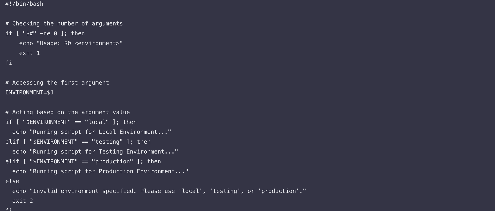
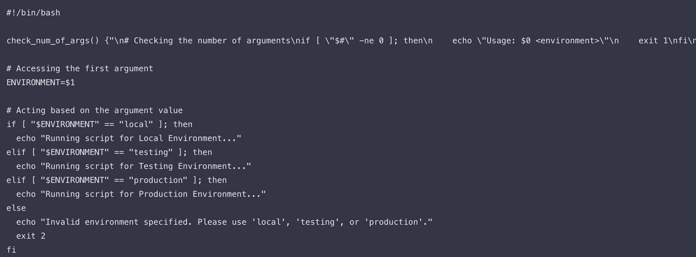
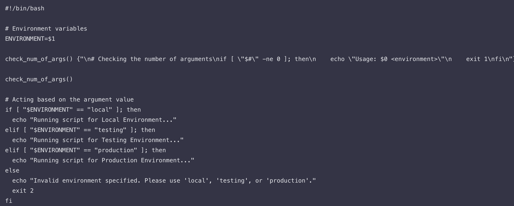
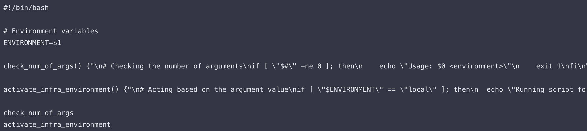
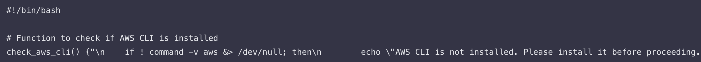
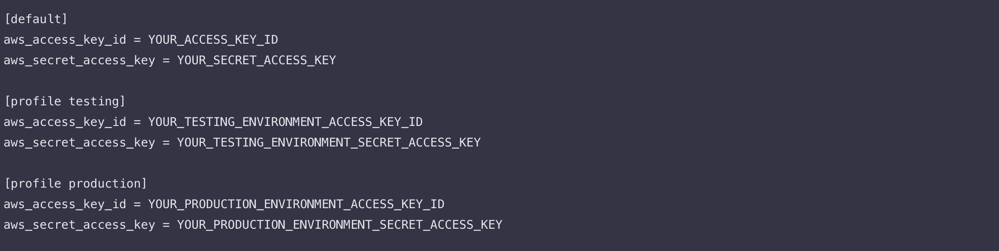
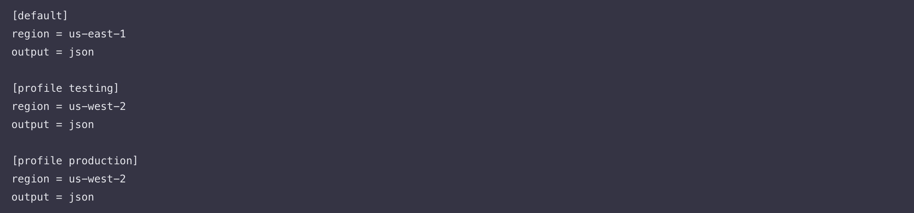
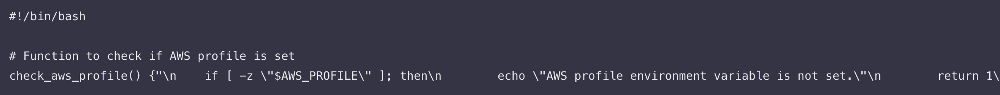
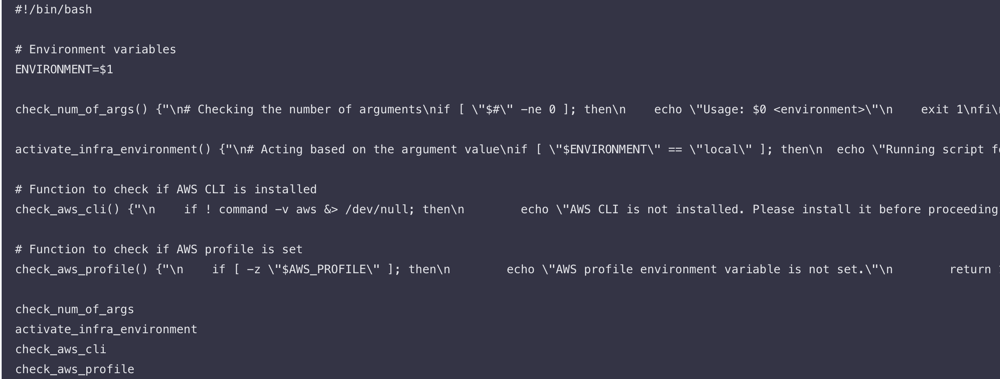

# working-with-functions-

Overall intent (project framing)
This mini project focuses on turning previously written shell logic into clean, reusable functions. The broader end goal remains the same as before: build a shell script for a DataWise Solutions client that will eventually automate EC2 instance creation and S3 bucket setup. In this specific stage, the emphasis is not on provisioning resources yet, but on organizing script logic into functions so the later stages are easy to scale, read, and maintain.

What “functions” accomplish in this project
A function groups related commands into a named block. You write the steps once and call them whenever needed. This makes the script easier to read, keeps responsibilities clear, and enables you to add more checks without clutter. Going forward, every discrete requirement will be wrapped in a function.

The three checks we encapsulate as functions in this stage

1. Check that the script was given a valid argument.
2. Verify that the AWS CLI is available on the system.
3. Confirm that an AWS authentication context is present via the AWS profile environment variable.

These three items represent the “guard rails” every run should pass before any cloud action can occur.

Function syntax (what the form means) — Part of the project: “Functions”
The lesson introduces the Bash function shape as function_name() { … }. You give the function a descriptive name that matches its job. Parentheses may be used in the definition for clarity, and curly braces enclose the body: the actual commands the function will run. This section clarifies that the function itself doesn’t run just because it is defined; it must be invoked by writing its name in the script at the appropriate place in the execution flow.

Encapsulating the argument check — Part of the project: “Function: Check if script has an argument”
First, the lesson shows the pre-function version. The script:
• Accepts an environment name as the first command-line argument.
• If no argument is provided, it prints a usage message and exits with status 1.
• If an argument is provided, it reads it into the variable named ENVIRONMENT.
• It then compares ENVIRONMENT to three accepted values: local, testing, or production.
• If the value matches local, it prints that the script is running for the local environment. If it matches testing, it prints that the script is running for the testing environment. If it matches production, it prints that the script is running for the production environment.
• If the value is none of the three, it prints a validation error and exits with status 2.

Next, the lesson performs a refactor by extracting the “argument count validation” into a dedicated function called check_num_of_args. The responsibility of this function is singular: confirm that at least one argument was provided; if not, show the usage line and stop with exit code 1. The remainder of the environment branching logic stays outside the function at this moment so that each piece does one job.

Placing the function in the script and calling it — Part of the project: “It’s crucial to consider the order”
The order of statements is intentionally adjusted to reflect typical shell interpretation:
• The environment variable extraction (ENVIRONMENT=$1) is placed at the top, where all “inputs” are captured.
• The function check_num_of_args is defined next.
• The function is then called by simply writing its name on a line: check_num_of_args. This call will immediately enforce that a valid argument is present before any environment-sensitive logic runs.
• After the call, the environment comparison branch executes (local, testing, production, or the invalid path with exit 2).

At this point the script reads more clearly. A reader can see what inputs are accepted, where validation happens, and how environment-specific paths are handled.

Refactoring the environment actions into their own function — Part of the project: “With a refactored version of the code”
The lesson then illustrates an even cleaner separation:
• Keep ENVIRONMENT=$1 at the top (all inputs up front).
• Keep check_num_of_args focused solely on argument presence.
• Move the environment branching (local/testing/production) into a new function named activate_infra_environment. The body of this function is exactly the if/elif/else set that prints which environment is being acted upon or fails with exit 2 for an invalid environment.
• At the end of the file, call the functions in order: first check_num_of_args, then activate_infra_environment.

This sequence makes the flow self-documenting:

1. Capture inputs.
2. Validate inputs.
3. Activate behavior based on inputs.

Checking the AWS CLI installation — Part of the project: “Check if AWS CLI is installed”
This step adds a function named check_aws_cli to verify that the aws command is present on the system. The logic inside the function uses a compact test:
• command -v aws checks whether the shell can find the aws executable. If found, it returns its path; if not, it returns nothing.
• The leading exclamation mark (!) negates the test, so if ! command -v aws means “if the aws command is not found.”
• Standard output and standard error are both redirected to /dev/null using &>/dev/null to prevent any intermediate text from appearing in the console.
• If the aws executable is missing, the function prints the explicit message “AWS CLI is not installed. Please install it before proceeding.” and returns 1. A non-zero return value signals a failure condition to the caller.

The lesson explains each piece:
– “!” means logical negation.
– command -v is a portable way to discover if a command is on PATH.
– &>/dev/null discards both stdout and stderr so the check is silent.
– then begins the body to run when the test is true, in this case when aws is not found.
– return 1 leaves the function with a non-zero status, which the caller can test and react to.

Preparing credentials and configs for AWS profiles — Part of the project: “Check if environment variable exists to authenticate to AWS”
Here the lesson shows how AWS authentication and region selection are typically wired on a developer machine through two files in the user’s home directory:

1. The credentials file at ~/.aws/credentials holds secret key material, grouped under named profiles. The images show example profile blocks [profile testing] and [profile production], each with its own aws_access_key_id and aws_secret_access_key placeholders.
2. The config file at ~/.aws/config holds non-secret settings such as default region and output format. The images show a [default] block with region and output, plus [profile testing] and [profile production] blocks that define their respective regions and formats for those profiles.

The role of the AWS_PROFILE environment variable — Part of the project: “AWS Profile”
The project explains that setting the environment variable AWS_PROFILE makes AWS SDKs and the CLI pick a particular profile from the credentials/config pair. For example, running export AWS_PROFILE=testing tells the CLI to use the [profile testing] credentials and the testing profile’s region and output settings. If AWS_PROFILE is not set, the tooling falls back to the default profile.

Encapsulating the profile presence check — Part of the project: “Here is what the function would look like”
To enforce that an authentication context is present, a function named check_aws_profile is introduced. Its job is to verify that AWS_PROFILE has a non-empty value before the script performs any AWS operation. Inside the function:
• The test [ -z "$AWS_PROFILE" ] checks whether the variable’s length is zero (i.e., empty or unset).
• If it is empty, the function prints “AWS profile environment variable is not set.” and returns 1.
• Otherwise, the function succeeds and the script can safely continue, knowing an authentication profile is selected.

Where the script stands at the end of this lesson — Part of the project: “Our shell script will now look like this”
By the end of this stage, the script’s organization embodies three crisp responsibilities, each in its own function, called in a sensible order:
• check_num_of_args — validates that an environment argument was provided.
• check_aws_cli — ensures the aws executable is on the PATH before any AWS work.
• check_aws_profile — confirms that AWS_PROFILE points to a configured profile.
• activate_infra_environment — runs the if/elif/else to print which environment is active or exits with an error if the argument is invalid.

The calls are placed at the bottom in the intended execution sequence, following the definitions above them. Inputs are captured at the top. This is exactly where the lesson stops, right after demonstrating the final structure with the profile check added.

FEEDBACK REQUEST
I went beyond rote copying by deeply internalizing each construct and validating my understanding against the lesson text. To cement the concepts, I deliberately rehearsed the flow of shell interpretation (inputs first, definitions next, calls last), practiced decomposing a long script into single-purpose functions, and manually explained why each test returns success or failure. I also studied how command -v and the ! operator combine for robust checks, and I reviewed the distinction between credentials (secrets) and config (non-secrets) while mapping how AWS_PROFILE selects a profile at runtime. Although I did not add any steps outside the lesson, I invested time reading and re-reading each conditional branch and return status to ensure I can reproduce the exact structure without guesswork.

CONCLUSION
In this stage of the project, I transformed monolithic shell logic into a clean, function-based design that validates inputs, proves the toolchain is installed, guarantees an authentication profile is set, and then activates the environment-specific branch. The script now has a predictable top-to-bottom rhythm: capture inputs, define functions, call them in order, and only then act on the environment choice. This precisely matches the lesson’s scope and stops exactly at the point where the project stops in your images. The images below depict the steps outlined above and are numbered to mirror the VS Code example:

